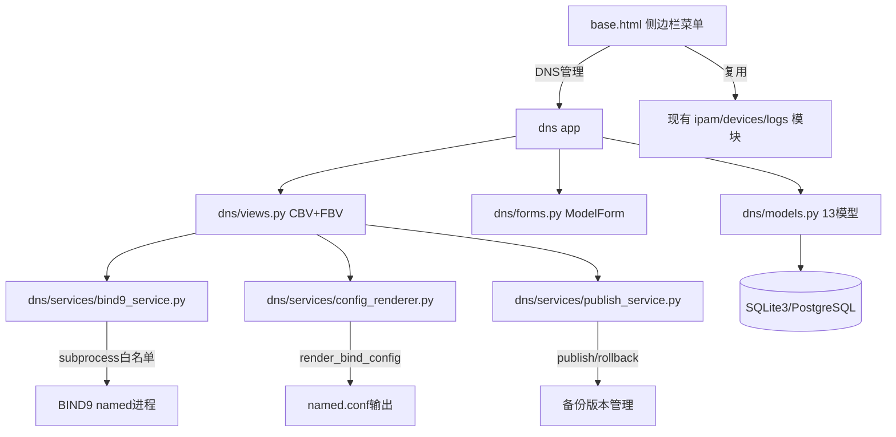
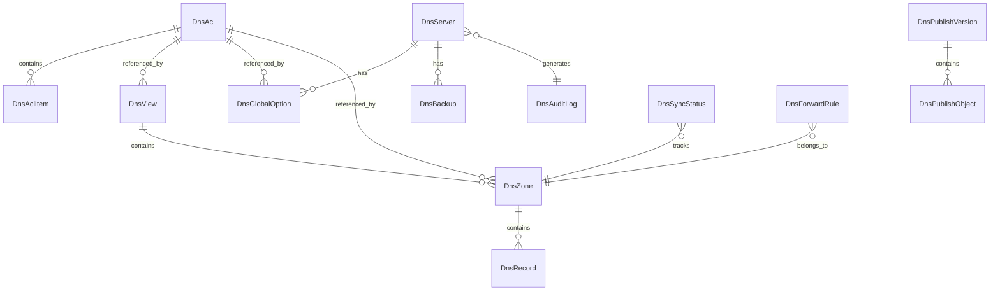

## Product Overview

在现有 Django DDI 管理系统中新增完整的"DNS管理"一级模块，包含14个二级菜单功能页面，用于对 BIND9 DNS 服务器进行全面的页面化管理，包括：DNS仪表盘、服务管理、配置同步、全局配置、ACL管理、View视图、区域管理、资源记录管理、转发管理、主从同步、日志中心、发布中心、备份回滚、审计日志。

## Core Features

### 功能模块清单（14个二级菜单）

1. **DNS仪表盘** - 展示named服务状态/BIND9版本/Zone总数/Master/Slave/Forward区数量/View数/ACL数/记录数/发布状态/异常摘要
2. **DNS服务管理** - 查看/控制named服务(启停重启reload/reconfig)/清理缓存/rndc状态/所有操作二次确认+审计日志
3. **配置同步** - 读取解析named.conf/include文件/zone文件/展示磁盘vs数据库差异/支持入库同步
4. **全局配置** - 管理BIND9 options(directory/listen-on/allow-query/recursion/forwarders等)/保存草稿/预览生成配置文本
5. **ACL管理** - ACL列表/新增/编辑/删除/条目(IP/CIDR/any/none/localhost/localnets)/引用检查
6. **View视图管理** - View列表/增删改/match-clients/match-destinations/recursion/分配Zone/预览配置
7. **区域管理** - Master/Slave/Forward/正向/反向区CRUD/校验/预览/reload单区/核心字段20+
8. **资源记录管理** - SOA/NS/A/AAAA/CNAME/MX/PTR/TXT/SRV记录CRUD/批量操作/SOA规则/Serial递增/CNAME约束
9. **转发管理** - 全局转发策略/forwarders/条件转发/上游测试
10. **主从同步** - Zone主从状态/serial对比/同步时间/allow-transfer/also-notify/手动触发
11. **日志中心** - 服务/查询/错误/解析/传送日志/筛选搜索分页导出
12. **发布中心** - 待发布对象展示/差异diff/业务校验/named-checkconf/checkzone/发布到正式目录/reload/失败回滚
13. **备份回滚** - 发布前自动备份/版本历史/详情/比较/一键回滚/自动reload
14. **审计日志** - DNS模块全操作审计(增删改发回滚服务控制)/操作人/IP/对象/变更前后/结果/时间

### 关键技术要求

- 数据库是唯一配置源，页面保存不直接覆盖named.conf（草稿->待发布->校验->备份->发布->reload流程）
- BIND9命令封装在service层，白名单机制，禁止任意shell拼接
- 所有危险操作需二次确认，关键操作写审计日志
- 完全遵循现有项目Django风格（CBV+FBV混合/ModelForm/bootstrap5模板/base.html继承）

## Tech Stack

- **后端框架**: Python 3.x + Django (现有项目)
- **前端渲染**: Django Template + Bootstrap 5 + Bootstrap Icons (与现有项目一致)
- **数据库**: SQLite3 (当前) / 兼容 PostgreSQL (后续迁移)
- **BIND9交互**: subprocess 封装 (白名单命令执行)
- **无前后端分离**: 纯Django服务端渲染，辅以少量原生JS/AJAX局部刷新

## Tech Architecture

### 架构模式: 分层架构（与现有项目一致）

```
Templates层 (templates/dns/*.html)     -- 页面渲染
   ↓
Views层 (dns/views.py)                 -- CBV+FBV, 请求处理/业务编排
   ↓
Forms层 (dns/forms.py)                 -- ModelForm / Form, 校验逻辑
   ↓
Models层 (dns/models.py)               -- 13个ORM模型, 唯一数据源
   ↓
Services层 (dns/services/)             -- BIND9交互/配置渲染/发布回滚
   ↓
Utils层 (dns/utils/)                   -- 辅助工具函数
```

### 系统组件关系图



### 模型关系图



## Implementation Details

### 核心设计决策

1. **新建独立 dns app** -- 13个模型职责独立，不适合塞入ipam/devices等已有app
2. **模板放 templates/dns/** -- 与 ipam/devices/logs 组织方式一致
3. **菜单注入 base.html:405行之后** -- 设备管理`</div>`和系统管理`<div class="menu-divider">`之间插入
4. **URL命名空间 `app_name='dns'`** -- 与其他app一致，根路由 `path('dns/', include('dns.urls'))`
5. **Service层三模块分工**:

- `bind9_service.py`: 只负责命令执行(status/checkconf/checkzone/rndc/systemctl)，返回结构化结果
- `config_renderer.py`: 从数据库ORM渲染named.conf文本和zone文件文本
- `publish_service.py`: 草稿->待发布->校验->备份->写入->reload的完整发布/回滚流程编排

### 性能与安全考量

- 列表页使用 `select_related`/`prefetch_related` 减少N+1查询
- 统计查询用 `count()`/`aggregate()` 避免加载全量数据
- 命令执行使用 `subprocess.run(timeout=30)` 防止阻塞
- 白名单命令: [systemctl, named-checkconf, named-checkzone, rndc, named-journalprint, cat]
- 所有用户输入经过 ModelForm clean 方法或 ORM 参数化查询

### 现有项目模式复用清单

| 复用项 | 来源 | 用途 |
| --- | --- | --- |
| `log_operation(user, action, 'dns', obj_type, old, new)` | common/logger.py | 全局审计入口 |
| base.html `` | templates/base.html | 页面布局继承 |
| confirm_delete.html pattern | ipam/confirm_delete.html | 删除确认页模板 |
| `@method_decorator([login_required], name='dispatch')` | ipam/views.py | 视图鉴权 |
| `messages.success(request, msg)` | Django messages框架 | 操作提示 |
| ModelForm + form-control widgets | ipam/forms.py | 表单样式统一 |


## Directory Structure

```
/opt/codebuddy/ddi_system/
├── dns/                                    # [NEW] DNS管理 Django App
│   ├── __init__.py                         # [NEW] 包初始化
│   ├── apps.py                             # [NEW] AppConfig(name='dns', verbose_name='DNS管理')
│   ├── models.py                           # [NEW] 13个核心ORM模型定义
│   ├── forms.py                            # [NEW] 全部表单(ModelForm+Form)
│   ├── views.py                            # [NEW] 全部视图(CBV+FBV混合)
│   ├── urls.py                             # [NEW] URL路由(app_name='dns', ~50条路由)
│   ├── admin.py                            # [NEW] Django Admin注册
│   ├── services/                           # [NEW] 业务服务层包
│   │   ├── __init__.py                     # [NEW] 服务包初始化
│   │   ├── bind9_service.py                # [NEW] BIND9命令封装(状态/校验/控制/缓存清理)
│   │   ├── config_renderer.py              # [NEW] 配置渲染引擎(DB->named.conf/zone文本)
│   │   └── publish_service.py              # [NEW] 发布/回滚流程框架(草稿/待发布/备份/发布/回滚)
│   ├── utils/                              # [NEW] 工具包
│   │   ├── __init__.py                     # [NEW] 工具包初始化
│   │   └── helpers.py                      # [NEW] 辅助函数(域名/FQDN校验/SOA serial/IP格式等)
│   └── migrations/
│       └── __init__.py                     # [NEW] 迁移目录
│       └── 0001_initial.py                 # [NEW] 初始迁移(由makemigrations生成)
│
├── templates/dns/                          # [NEW] DNS模块模板目录
│   ├── dashboard.html                      # [NEW] DNS仪表盘(状态卡片+统计+最近发布+异常摘要)
│   ├── service.html                        # [NEW] DNS服务管理(状态信息+操作按钮+确认弹窗+执行结果)
│   ├── config_sync.html                    # [NEW] 配置同步(磁盘文件树+解析结果+差异对比+同步按钮)
│   ├── options.html                        # [NEW] 全局配置编辑(options表单+保存草稿+预览+待发布)
│   ├── acl_list.html                       # [NEW] ACL列表页(表格+搜索+条目数+引用状态)
│   ├── acl_form.html                       # [NEW] ACL表单页(名称+条目编辑器+引用检查提示)
│   ├── view_list.html                      # [NEW] View列表页(表格+match条件概要+关联Zone数)
│   ├── view_form.html                      # [NEW] View表单页(match-clients/destinations/Zone分配)
│   ├── zone_list.html                      # [NEW] Zone列表页(表格+类型筛选+方向筛选+状态标签)
│   ├── zone_form.html                      # [NEW] Zone表单页(20+字段分组:基本信息/SOA参数/主从/转发)
│   ├── zone_detail.html                    # [NEW] Zone详情页(SOA信息+记录列表+跳转记录管理)
│   ├── record_list.html                    # [NEW] 记录列表页(按Zone查看+类型筛选+搜索+批量操作栏)
│   ├── record_form.html                    # [NEW] 记录表单页(类型选择+动态字段+业务规则提示)
│   ├── forward.html                        # [NEW] 转发管理(全局转发+条件转发列表+上游测试工具)
│   ├── sync.html                           # [NEW] 主从同步(Zone主从状态表+serial对比+同步日志)
│   ├── logs.html                           # [NEW] 日志中心(日志类型Tab+时间筛选+域名搜索+分页+导出)
│   ├── publish.html                        # [NEW] 发布中心(待发布列表+diff视图+校验结果+发布按钮)
│   ├── backup.html                         # [NEW] 备份回滚(版本时间线+详情+版本比较+回滚确认)
│   └── audit.html                          # [NEW] 审计日志(操作类型筛选+对象搜索+时间范围+变更对比)
│
├── ddi_system/
│   ├── settings.py                         # [MODIFY] INSTALLED_APPS添加'dns.apps.DnsConfig'
│   └── urls.py                             # [MODIFY] urlpatterns添加path('dns/', include('dns.urls'))
│
├── templates/
│   └── base.html                           # [MODIFY] 在设备管理和系统管理间插入DNS管理菜单组(14项)
│
├── logs/
│   └── views.py                            # [MODIFY] modules选项添加('dns','DNS管理')
│
└── static/dns/                             # [NEW] 如有需要(暂不预设,按实际添加)
    ├── css/                                # [NEW] DNS专用样式(如需)
    └── js/                                 # [NEW] DNS专用JS(如需:实时刷新/图表等)
```

## Key Code Structures

### Models 核心模型定义(13个)

```python
# dns/models.py - 模型关系总览

class DnsServer(models.Model):
    """DNS服务器实例"""
    hostname = models.CharField('主机名', max_length=200)
    ip_address = models.GenericIPAddressField('管理IP')
    bind_version = models.CharField('BIND版本', max_length=50, blank=True)
    named_conf_path = models.CharField('配置路径', max_length=500, default='/etc/named.conf')
    is_local = models.BooleanField('本地服务器', default=True)
    enabled = models.BooleanField('启用监控', default=True)
    # ... created_at, updated_at, created_by

class DnsGlobalOption(models.Model):
    """BIND9全局options配置"""
    server = models.ForeignKey(DnsServer, ...)
    directory = models.CharField(max_length=500)
    listen_on_v4 = models.TextField(blank=True)      # 多行IP,每行一个
    listen_on_v6 = models.CharField(max_length=100)
    allow_query = models.TextField(blank=True)
    allow_recursion = models.TextField(blank=True)
    recursion = models.BooleanField(default=False)
    dnssec_validation = models.CharField(max_length=20)
    forward_policy = models.CharField(max_length=20)  # only/first
    forwarders = models.TextField(blank=True)         # 多行IP
    raw_config = models.TextField('原始高级配置', blank=True)
    is_draft = models.BooleanField('是否草稿', default=False)
    # ... created_at, updated_at, created_by

class DnsAcl(models.Model):
    """ACL定义"""
    name = models.CharField(max_length=100, unique=True)
    description = models.TextField(blank=True)
    # ... created_at, updated_at

class DnsAclItem(models.Model):
    """ACL条目"""
    acl = models.ForeignKey(DnsAcl, related_name='items', on_delete=models.CASCADE)
    ITEM_TYPE_CHOICES = (('ip', 'IPv4地址'), ('ipv6', 'IPv6地址'), ('cidr', 'CIDR网段'),
                         ('key', 'TSIG密钥'), ('acl', '引用ACL'), ('any', '任意'),
                         ('none', '拒绝'), ('localhost', '本机'), ('localnets', '本地网络'))
    item_type = models.CharField(max_length=20, choices=ITEM_TYPE_CHOICES)
    value = models.CharField(max_length=500)
    order_index = models.IntegerField(default=0)

class DnsView(models.Model):
    """BIND9 View"""
    name = models.CharField(max_length=100, unique=True)
    match_clients = models.ManyToManyField(DnsAcl, blank=True, related_name='used_in_view_clients')
    match_destinations = models.ManyToManyField(DnsAcl, blank=True, related_name='used_in_view_dests')
    recursion = models.BooleanField(default=None, null=True)
    allow_query_acl = models.ForeignKey(DnsAcl, null=True, blank=True,
                                        on_delete=models.SET_NULL, related_name='view_query')
    allow_recursion_acl = models.ForeignKey(DnsAcl, null=True, blank=True,
                                            on_delete=models.SET_NULL, related_name='view_recursion')
    description = models.TextField(blank=True)
    order_index = models.IntegerField(default=0)
    # ...

class DnsZone(models.Model):
    """DNS区域(核心模型, 20+字段)"""
    ZONE_TYPE_CHOICES = (('master', '主区域'), ('slave', '从区域'), ('forward', '转发区域'), ('stub', '存根区域'))
    DIRECTION_CHOICES = (('forward', '正向区域'), ('reverse', '反向区域'))
    name = models.CharField('区域名称', max_length=255)  # 如 example.com 或 10.168.192.in-addr.arpa
    zone_type = models.CharField(max_length=20, choices=ZONE_TYPE_CHOICES)
    direction_type = models.CharField(max_length=20, choices=DIRECTION_CHOICES)
    view = models.ForeignKey(DnsView, null=True, blank=True, on_delete=models.SET_NULL, related_name='zones')
    file_name = models.CharField('文件名', max_length=255, blank=True)
    default_ttl = models.IntegerField('默认TTL', default=3600)
    primary_ns = models.CharField('主DNS服务器', max_length=255, blank=True)
    admin_mail = models.CharField('管理员邮箱(RNAME)', max_length=255, blank=True)
    serial_no = models.IntegerField('序列号', default=2026042401)
    refresh = models.IntegerField('刷新间隔', default=3600)
    retry = models.IntegerField('重试间隔', default=600)
    expire = models.IntegerField('过期时间', default=86400)
    minimum = models.MinimumTTL('最小TTL', default=3600)
    master_ips = models.TextField('主服务器IP', blank=True)        # slave区用,逗号分隔
    forwarders = models.TextField('转发目标', blank=True)          # forward/stub区用
    forward_policy = models.CharField(max_length=10, blank=True)   # first/only
    allow_transfer_acl = models.ForeignKey(DnsAcl, null=True, blank=True, ...)
    allow_update_acl = models.ForeignKey(DnsAcl, null=True, blank=True, ...)
    dynamic_update = models.BooleanField(default=False)
    enabled = models.BooleanField(default=True)
    description = models.TextField(blank=True)
    # ...

class DnsRecord(models.Model):
    """DNS资源记录"""
    RECORD_TYPE_CHOICES = (('SOA','SOA'),('NS','NS'),('A','A'),('AAAA','AAAA'),
                           ('CNAME','CNAME'),('MX','MX'),('PTR','PTR'),
                           ('TXT','TXT'),('SRV','SRV'))
    zone = models.ForeignKey(DnsZone, related_name='records', on_delete=models.CASCADE)
    record_type = models.CharField(max_length=10, choices=RECORD_TYPE_CHOICES)
    name = models.CharField('名称', max_length=255)           # 相对名称或@
    ttl = models.IntegerField('TTL', null=True, blank=True)   # null表示使用zone默认
    value = models.TextField('记录值')                        # A=IP, CNAME=FQDN, MX="优先级 目标"
    priority = models.IntegerField('优先级', null=True, blank=True)  # MX/SRV用
    enabled = models.BooleanField(default=True)
    # ...

class DnsForwardRule(models.Model):
    """转发规则(全局/条件转发)"""
    RULE_TYPE_CHOICES = (('global', '全局转发'), ('conditional', '条件转发'))
    rule_type = models.CharField(max_length=20, choices=RULE_TYPE_CHOICES)
    zone = models.ForeignKey(DnsZone, null=True, blank=True, ...)  # 条件转发关联zone
    forwarders = models.TextField()          # 逗号分隔IP列表
    policy = models.CharField(max_length=10)  # first/only
    # ...

class DnsSyncStatus(models.Model):
    """主从同步状态"""
    zone = models.OneToOneField(DnsZone, ...)
    local_serial = models.IntegerField()
    remote_serial = models.IntegerField(null=True)
    last_sync_time = models.DateTimeField(null=True)
    last_sync_result = models.CharField(max_length=50, blank=True)
    # ...

class DnsPublishVersion(models.Model):
    """发布版本"""
    version_number = models.CharField(max_length=50)
    status = models.CharField(max_length=20)  # pending/success/failed/rolled_back
    publish_time = models.DateTimeField(auto_now_add=True)
    publisher = models.ForeignKey(settings.AUTH_USER_MODEL, ...)
    notes = models.TextField(blank=True)
    # ...

class DnsPublishObject(models.Object):
    """发布对象(某个版本的变更明细)"""
    version = models.ForeignKey(DnsPublishVersion, ...)
    object_type = models.CharField(max_length=50)  # zone/global_option/acl/view/record/forward
    object_id = models.IntegerField()
    action = models.CharField(max_length=20)       # create/update/delete
    diff_content = models.TextField(blank=True)    # 变更diff
    check_result = models.CharField(max_length=20, blank=True)  # pass/fail/error
    # ...

class DnsBackup(models.Model):
    """配置备份"""
    version = models.ForeignKey(DnsPublishVersion, ...)
    backup_type = models.CharField(max_length=20)  # pre_publish/manual
    config_content = models.TextField()            # named.conf内容快照
    file_size = models.IntegerField()
    storage_path = models.CharField(max_length=500)
    # ...

class DnsAuditLog(models.Model):
    """DNS专用审计日志(比OperationLog更详细)"""
    user = models.ForeignKey(settings.AUTH_USER_MODEL, ...)
    action = models.CharField(max_length=50)       # create_zone/delete_record/publish/rollback/service_start...
    category = models.CharField(max_length=30)     # zone/record/acl/view/global/service/publish/backup/sync
    object_name = models.CharField(max_length=255)
    detail = models.TextField(blank=True)
    old_value = models.TextField(blank=True)
    new_value = models.TextField(blank=True)
    result = models.CharField(max_length=20)       # success/failed/pending
    client_ip = models.GenericIPAddressField(null=True)
    operation_time = models.DateTimeField(auto_now_add=True)
    # Meta: indexes on category, action, operation_time
```

## 设计方案概述

本项目为纯Django服务端渲染的Web管理系统，无需引入新的前端框架。DNS管理模块的所有页面严格复用现有项目的UI规范：

- 继承 `templates/base.html` 的侧边栏+顶栏+主内容区布局
- 使用 Bootstrap 5 组件体系（card/table/form/badge/alert/modal）
- 使用 Bootstrap Icons 图标库（bi-globe2/bi-speedometer2 等）
- CSS变量主题色（--primary-dark: #1a365d, --accent: #4fd1c5）保持一致
- 表格、卡片、状态标签、分页、表单布局完全沿用现有风格

### DNS管理一级菜单位置

插入在 `base.html` 中"设备管理"和"系统管理"之间（第405-406行之间），使用 `bi-globe2` 图标标识。

### 二级菜单图标映射

- DNS仪表盘: bi-speedometer2
- DNS服务管理: bi-router
- 配置同步: bi-arrow-repeat
- 全局配置: bi-sliders2
- ACL管理: bi-shield-lock
- View视图: bi-layers
- 区域管理: bi-diagram-3-square
- 资源记录管理: bi-database
- 转发管理: bi-arrow-right-circle
- 主从同步: bi-arrow-left-right
- 日志中心: bi-journal-text
- 发布中心: bi-cloud-upload
- 备份回滚: bi-clock-history
- 审计日志: bi-clipboard-data

## Agent Extensions

### SubAgent

- **code-explorer**
- Purpose: 在实现过程中进行跨文件的代码搜索和验证，确保新增代码与现有项目的一致性（如确认导入路径、检查命名冲突等）
- Expected outcome: 快速定位现有代码中的模式和约定，确保DNS模块代码风格与项目完全一致