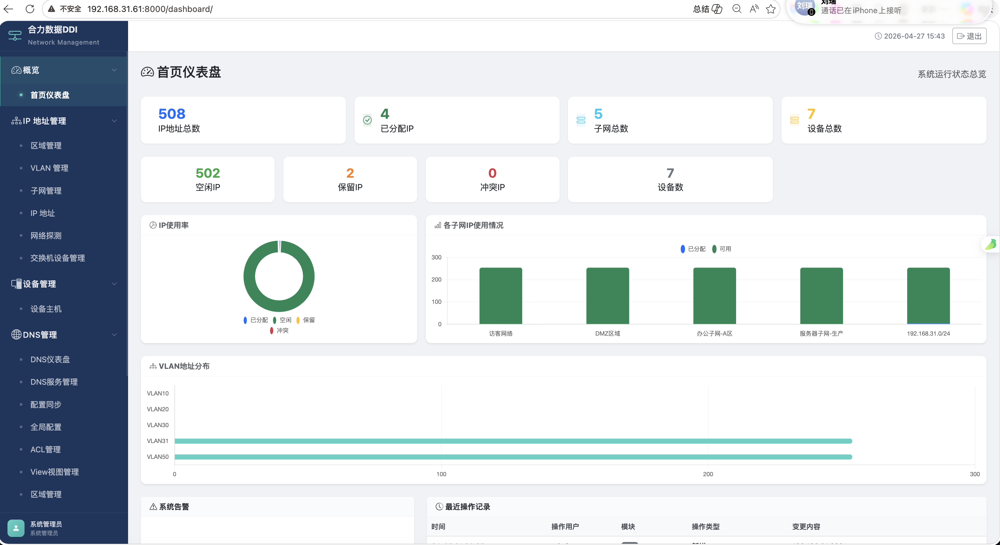

# 合力数据 DDI 管理系统 v2.0

<p align="center">
  <strong>DDI (DNS + IPAM) 网络资源统一管理平台 — 集成 BIND9</strong>
</p>

<p align="center">
  
  
  
  
  
</p>
---

## 一、项目简介

**合力数据 DDI 管理系统** 是一套基于 **Python / Django** 开发的轻量级 Web 网络基础设施管理平台，统一管理企业内部的 **IP 地址（IPAM）** 和 **DNS 域名解析**。系统深度集成 **BIND9**，支持从 Web 界面直接配置、校验、发布和回滚 BIND9 配置，适合中小型企业的网络运维场景。

### 核心亮点

| 特性 | 说明 |
|------|------|
| **BIND9 深度集成** | Web 端编辑 → `named-checkconf/checkzone` 校验 → 备份 → 一键发布 → 失败自动回滚 |
| **完整配置渲染器** | 从数据库模型自动生成标准 `named.conf`，含 options/acl/view/zone/logging |
| **ACL + View 视图** | 支持 BIND9 的 ACL 定义与 View 分视图解析，按客户端来源返回不同结果 |
| **发布中心** | 版本化发布管理：草稿 → 校验 → 备份 → 发布 → 回滚，全链路审计 |
| **IPAM 四级层级** | 区域(Region) → VLAN → 子网(Subnet) → IP地址，CIDR 自动计算 |
| **网络探测子系统** | 内置 Ping / 端口扫描 / 拓扑发现引擎，后台异步执行 |
| **交换机设备管理** | 支持通过 SSH 登录交换机获取 ARP/MAC 表，联动 IP 地址分配 |
| **双轨审计日志** | 全局操作日志 + DNS 专用审计日志（27 种操作类型） |
| **轻量依赖** | Django + gunicorn + paramiko + dnspython + Pillow |

---

## 二、功能模块总览

### 各模块详细说明

| 模块 | 路由前缀 | 核心功能 |
|------|----------|----------|
| **仪表盘** | `/dns/` 或 `/dashboard/` | DNS 运行状态卡片、Zone/记录统计图表、最近操作日志 |
| **DNS 管理** | `/dns/` | **47 条路由** — 见下方详表 |
| **IPAM** | `/ipam/` | **37 条路由** — 区域/VLAN/子网/IP四级管理 + 网络探测 |
| **设备管理** | `/devices/` | 设备 CRUD（11 种类型）、IP 关联绑定 |
| **用户认证** | `/accounts/` | 登录/登出、用户 CRUD、4 种角色、登录日志 |
| **审计日志** | `/logs/` | 全量操作记录追溯 |

### DNS 管理模块详解（核心模块）

| 功能分类 | 路由 | 说明 |
|---------|------|------|
| **DNS 仪表盘** | `dns/` | 服务运行状态、Zone/记录/Acl 统计、最近变更 |
| **服务管理** | `dns/service/` | 启动/停止/重启/重载/刷新缓存/清理缓存/状态检查 |
| **全局配置** | `dns/options/` | options{} 全部参数编辑（监听/查询控制/转发/DNSSEC/性能），实时预览渲染结果 |
| **配置同步** | `dns/sync-config/` | 数据库 → 文件同步，对比 diff 展示 |
| **ACL 管理** | `dns/acl/*` | CRUD + 9 种条目类型（ip/cidr/key/acl_ref/any/none/localhost/localnets） |
| **View 视图** | `dns/views/*` | match-clients/match-destinations/allow-query/recursion 关联，预览渲染 |
| **Zone 区域** | `dns/zones/*` | 正向/反向/主从/转发区 CRUD，SOA 参数编辑，named-checkzone 校验 |
| **资源记录** | `dns/records/*` | SOA/NS/A/AAAA/CNAME/MX/PTR/TXT/SRV 共 9 种记录，批量导入导出 CSV |
| **转发规则** | `dns/forwards/*` | 全局转发 / 条件转发（关联 Zone），在线测试转发器连通性 |
| **主从同步** | `dns/sync-status/` | Zone 级别主从 Serial 对比、手动触发通知 |
| **日志中心** | `dns/log-center/` | BIND9 query.log 解析展示 |
| **发布中心** | `dns/publish/*` | 一键发布（校验→备份→写入→reload）、版本历史、失败回滚 |
| **备份回滚** | `dns/backups/*` | 发布前自动备份、手动备份、一键回滚到任意历史版本 |
| **DNS 审计** | `dns/audit/*` | 27 种操作的专用审计日志，变更前后值对比 |

---

## 三、技术栈

| 层面 | 技术 | 版本 |
|------|------|------|
| **后端框架** | Python / Django | >=4.2, <6.0 |
| **前端 UI** | Django Template / Bootstrap 5 / Chart.js / Bootstrap Icons | 5.3 / 4.x / 1.x |
| **前端增强** | Select2 (jQuery插件) | CDN 引入 |
| **DNS 服务端** | ISC BIND9（源码编译安装） | **9.16.23** |
| **数据库** | SQLite 3（默认）/ 可迁移 MySQL/PostgreSQL | — |
| **WSGI 服务器** | Gunicorn (生产) / Django Dev Server (开发) | >=21.0 |
| **语言/时区** | 简体中文 (zh-hans) / Asia/Shanghai | — |
| **认证方式** | Django Session Auth (扩展 User 模型 + Role RBAC) | — |
| **辅助库** | paramiko (SSH)、dnspython (DNS查询)、Pillow (图片) | — |

---

## 四、快速开始

### 前置要求

- Python 3.11+
- pip 包管理器
- （可选）BIND9 9.16.23（用于 DNS 服务集成）

### 安装步骤

```bash
# 克隆项目
git clone <repo-url>
cd ddi_system

# 1. 安装依赖
pip install -r requirements.txt

# 2. 数据库迁移
python manage.py makemigrations
python manage.py migrate

# 3. 初始化数据（推荐首次运行）
python manage.py init              # 完整初始化（含示例数据）
# python manage.py init --minimal   # 仅基础配置（角色+管理员+DNS）

# 4. 启动开发服务器
python manage.py dev               # 或: python manage.py runserver 0.0.0.0:8000
```

### 访问系统

打开浏览器访问：`http://127.0.0.1:8000/`

| 项目 | 值 |
|------|-----|
| 默认账号 | `admin` |
| 默认密码 | `Admin@123` |

### 安装 BIND9(必须安装)

```bash
# 源码编译安装指定版本 9.16.23
sudo ./install_bind9.sh

# 卸载（如需要）
sudo ./uninstall_bind9.sh
```

`install_bind9.sh` 特性：
- 从 ISC 官方源码下载并编译安装 BIND **9.16.23**
- 自动检测 OS 类型（CentOS/RHEL/Rocky/Ubuntu/Debian）
- 生成完整 systemd 服务文件（含安全加固）
- 创建 rndc 密钥、localhost zone、根提示文件
- 配置独立查询日志通道 (`query_log`)
- 自动清理编译临时文件

### 快捷脚本启动/停止

```bash
# 开发模式启动（Django runserver，前台运行）
./start.sh dev              # http://0.0.0.0:8000

# 生产模式启动（Gunicorn 后台守护进程，4 workers）
./start.sh prod             # http://0.0.0.0:8000

# 停止服务（优雅停止 / 强制停止）
./stop.sh                   # SIGTERM 优雅停止
./stop.sh -k                # SIGKILL 强制停止
```

### 生产环境部署

```bash
# 收集静态文件
python manage.py collectstatic

# 使用 Gunicorn 启动
gunicorn ddi_system.wsgi --bind 0.0.0.0:8000 --workers 4
```

---

## 五、项目结构

```
ddi_system/
├── manage.py                          # Django 入口 (增强版: init/dev 快捷命令)
├── __main__.py                        # 包入口 (python -m ddi_system)
├── init_data.py                       # 初始化数据脚本 (角色/管理员/DNS/IPAM 示例)
├── requirements.txt                   # 依赖: Django/gunicorn/paramiko/dnspython/Pillow
├── install_bind9.sh                   # BIND9 9.16.23 源码编译安装脚本
├── uninstall_bind9.sh                 # BIND9 卸载脚本
├── start.sh                           # 启动脚本 (dev/prod 模式)
├── stop.sh                            # 停止脚本 (优雅/强制)
├── README.md                          # 本文档
│
├── ddi_system/                        # Django 项目配置包
│   ├── settings.py                    # 全局配置 (7 个业务应用注册)
│   ├── urls.py                        # 主路由分发 (7 个模块)
│   ├── wsgi.py                        # WSGI 部署入口
│   └── asgi.py                        # ASGI 异步入口
│
├── accounts/                          # 用户认证与角色管理
│   ├── models.py                      # Role, User(AbstractUser), LoginLog
│   ├── views.py                       # 登录/登出/CRUD/重置密码
│   ├── forms.py                       # 登录/用户创建/编辑表单
│   └── urls.py                        # 9 条路由
│
├── dashboard/                         # 首页仪表盘
│   ├── views.py                       # index() 统计聚合视图
│   └── templates/index.html           # 仪表盘页面 (卡片+图表)
│
├── ipam/                              # IP 地址管理 + 网络探测 (最大模块之一)
│   ├── models.py                      # Region, VLAN, Subnet, IPAddress
│   ├── views.py                       # CRUD + 分配/释放/批量操作
│   ├── forms.py                       # CIDR/MAC 校验表单
│   ├── scan_models.py                 # ScanTask/DiscoveryRule/ProbeResult/TopologyNode/SwitchDevice
│   ├── scan_views.py                  # 探测/交换机 视图
│   ├── scanner.py                     # Ping/端口扫描/TCP 引擎 (~6KB)
│   └── urls.py                        # 37 条路由 (含探测 API + 交换机)
│
├── dns/                               # DNS 管理 (最大模块, 47 条路由)
│   ├── models.py                      # 13 个模型 (见下方数据模型)
│   ├── views.py                       # 全部业务视图 (~70KB)
│   ├── forms.py                       # DNS 记录/Zone/ACL/View/Options 表单 (~26KB)
│   ├── services/
│   │   ├── bind9_service.py           # BIND9 操作封装 (~22KB): checkconf/checkzone/reload/status
│   │   ├── config_renderer.py         # named.conf 渲染引擎 (~20KB): options/acl/view/zone/logging
│   │   └── publish_service.py         # 发布流程编排 (~26KB): 校验→备份→写入→reload→回滚
│   ├── utils/
│   │   └── helpers.py                 # DNS 工具函数 (~11KB): zone 序列号/FQDN/PTR 等
│   └── urls.py                        # 47 条路由 (14 个功能分组)
│
├── devices/                           # 设备/主机管理
│   ├── models.py                      # Device, DeviceInterface (多网卡)
│   ├── views.py                       # 设备 CRUD + IP 关联
│   ├── forms.py                       # 设备表单 (含 IP 地址 Select2 搜索)
│   └── urls.py                        # 6 条路由
│
├── logs/                              # 审计日志
│   ├── models.py                      # OperationLog
│   ├── views.py                       # 操作日志列表与筛选
│   └── urls.py                        # 1 条路由
│
├── common/                            # 公共工具包
│   ├── ip_utils.py                    # IP 工具 (CIDR 验证/PTR 生成/网段计算)
│   └── logger.py                      # 操作日志统一记录器
│
├── static/                            # 静态资源 (本地副本)
│   ├── css/                           # Bootstrap 5 / Select2 / Bootstrap Icons
│   ├── js/                            # jQuery / Bootstrap / Chart.js / Select2
│   └── fonts/                         # Bootstrap Icons 字体文件
│
└── templates/                         # HTML 模板 (55 个文件)
    ├── base.html                      # 布局基座 (固定侧边栏 + 顶栏 + 响应式)
    ├── pagination.html                 # 通用分页组件
    ├── accounts/                      # 登录页/用户列表/表单/登录日志 (5 个)
    ├── dashboard/                     # 仪表盘 (1 个)
    ├── ipam/                          # 区域/VLAN/子网/IP/探测全套页面 (17 个)
    ├── dns/                           # DNS 全套页面 (21 个):
    │   ├── dashboard.html             # DNS 仪表盘
    │   ├── service.html               # 服务管理 (启停/状态/缓存)
    │   ├── options.html               # 全局配置编辑
    │   ├── acl_form.html / acl_list.html  # ACL 管理
    │   ├── view_form.html / view_list.html  # View 视图
    │   ├── zone_*.html                # Zone 列表/详情/表单/删除/预览
    │   ├── record_*.html              # 记录列表/表单/删除
    │   ├── forward.html               # 转发规则
    │   ├── publish.html               # 发布中心 (一键发布)
    │   ├── backup.html                # 备份列表/回滚
    │   ├── audit.html                 # DNS 审计日志
    │   ├── config_sync.html           # 配置同步
    │   ├── logs.html                  # 日志中心
    │   └── sync.html                  # 主从同步状态
    ├── devices/                       # 设备列表/详情/表单/删除/IP关联 (5 个)
    └── logs/                          # 操作日志 (1 个)
```

---

## 六、URL 路由一览

| 前缀 | 模块 | 主要路径 | 数量 |
|------|------|----------|------|
| `/admin/` | Django Admin | 后台管理 | — |
| `/accounts/` | 用户认证 | login, logout, users/*, roles/*, login-log/* | **9** |
| `/dashboard/` | 仪表盘 | index (首页) | **1** |
| `/dns/` | DNS 管理 | service, options, acl/*, views/*, zones/*, records/*, forwards/*, sync-status, log-center, publish/*, backups/*, audit/*, sync-config | **47** |
| `/ipam/` | IPAM | regions/*, vlans/*, subnets/*, ips/*, scan/*, api/*, scan/switches/* | **37** |
| `/devices/` | 设备 | list, create, `<pk>/edit`, `<pk>/delete`, `<pk>/link-ip/<ip>` | **6** |
| `/logs/` | 日志 | operation_log | **1** |

**总计**: **101+** 条 URL 路由

---

## 七、数据模型概览

```
accounts (3 个模型)
├── Role             (id, name, code, description)
├── User             (AbstractUser + role→FK[Role], real_name, phone,
│                     department, is_active, last_login_ip)
└── LoginLog         (user→FK, username, ip_address, user_agent, status)

ipam (4 个模型)
├── Region           (id, name, code, description) [subnet_count, vlan_count]
├── VLAN             (id, vlan_id, name, region→FK, purpose, gateway)
├── Subnet           (id, name, cidr, gateway, prefix_len, region→FK,
│                     vlan→FK, purpose)
│                     [total_ips, allocated_ips, available_ips, usage_percent]
└── IPAddress        (id, ip_address, subnet→FK, status, hostname,
                     mac_address, device_name, owner, department,
                     device_type, binding_type, notes, created_by→FK)

dns (13 个模型 — 核心模块)
├── DnsServer        (id, hostname, ip_address, bind_version,
│   named_conf_path, zone_dir, log_file, is_local, enabled)
│                     [get_local_server() 类方法]
│
├── DnsGlobalOption  (server→OneToOne[DnsServer], directory, listen_on_v4/v6,
│   allow_query, allow_recursion, recursion, dnssec_validation,
│   forward_policy, forwarders, querylog_enable, max_cache_size,
│   version_hide, raw_config, is_draft)
│
├── DnsAcl           (id, name, description, built_in) [item_count, can_delete()]
│   └── DnsAclItem    (acl→FK, item_type{9种}, value, order_index) [render()]
│
├── DnsView          (id, name, match_clients→M2M[Acl], match_destinations→M2M[Acl],
│   recursion, allow_query_acl→FK[Acl], allow_recursion_acl→FK[Acl],
│   order_index) [zone_count]
│
├── DnsZone          (id, name, zone_type{4种}, direction_type{2种}, view→FK,
│   default_ttl, primary_ns, admin_mail, serial_no, refresh/retry/expire/minimum,
│   master_ips, slave_ips, forwarders, forward_policy,
│   allow_transfer_acl→FK, allow_update_acl→FK, dynamic_update, enabled)
│                     [record_count, generate_filename(), bump_serial(), get_soa_record()]
│
├── DnsRecord        (zone→FK, record_type{9种}, name, ttl, value,
│   priority, weight, port, enabled) [clean() 校验规则]
│
├── DnsForwardRule   (rule_type{global/conditional}, zone→FK, forwarders,
│   policy{first/only}, description, enabled)
│
├── DnsSyncStatus    (zone→OneToOne, local_serial, remote_serial,
│   last_sync_time/result/message, also_notify) [in_sync]
│
├── DnsPublishVersion(id, version_number, status{5种}, publisher→FK,
│   publish_time, notes, checkconf_passed, checkzone_results,
│   object_count)
│   └── DnsPublishObject(version→FK, object_type{7种}, object_id, object_name,
│      action{create/update/delete}, diff_content, check_result, publish_status)
│
├── DnsBackup        (version→FK, backup_type{3种}, config_content, file_size,
│   storage_path, backup_time, backup_user→FK, notes)
│
└── DnsAuditLog      (user→FK, action{27种}, category{10种}, object_name,
   detail, old_value, new_value, result, client_ip, operation_time)
     [indexes: (category,action), (object_name), (operation_time)]

devices (2 个模型)
├── Device           (id, hostname, device_name, device_type{11种}, manager,
│                     department, mac_address, os, region→FK, ip_address→FK)
│                     [linked_dns_records]
└── DeviceInterface  (device→FK, name, mac_address, ip_address→FK, is_primary)

logs (1 个模型)
└── OperationLog     (user→FK, module, action, object_type,
                     old_value, new_value, ip_address, operation_time)
```

**总计**: **25 个业务数据模型**（其中 DNS 占 13 个）

---

## 八、初始化数据说明

执行 `python manage.py init` 将按顺序创建以下数据：

| 步骤 | 函数 | 创建内容 |
|------|------|----------|
| **1/7** | `create_roles()` | 4 种角色: 系统管理员 / 网络管理员 / 运维人员 / 审计用户 |
| **2/7** | `create_admin_user()` | 管理员账户: `admin` / `Admin@123` |
| **3/7** | `init_dns_server()` | 本地 DNS 服务器实例 (hostname=ns.devnets.net, BIND 9.16.23) |
| **4/7** | `init_dns_global_option()` | 全局配置: recursion=yes, forward=first, dnssec=no, querylog=on |
| **5/7** | `init_dns_acls()` | 3 个 ACL: ID(内网全段) / Trusted(管理网) / SlaveServers(预留空) |
| **6/7** | `init_dns_view()` + `init_dns_zone()` + `init_dns_reverse_zone()` | IDC_View 视图 + devnets.net 正向区域 (11 条记录) + 反向区域 |
| **7/7** | IPAM + Devices (仅完整模式) | 4 区域 / 5 VLAN / 5 子网 / 5 设备 + 交换机 |

> **注意**: 必须先完成 `migrate` 再运行此脚本。使用 `--minimal` 参数跳过第 7 步。

---

## 九、用户角色体系

| 角色 | 编码 | 权限范围 |
|------|------|----------|
| **系统管理员** | `admin` | 全部权限：用户管理、系统配置、所有模块读写 |
| **网络管理员** | `network_admin` | IPAM / DNS / 设备全部资源管理 |
| **运维人员** | `operator` | 资源查询、IP 申请/释放/保留、主机信息维护 |
| **审计用户** | `auditor` | 只读访问：可查看所有资源和变更记录日志 |

---

## 十、DNS 核心工作流

### 发布流程

```
Web 编辑配置 → 保存到数据库(草稿状态)
       ↓
点击「一键发布」
       ↓
  ┌─ Step 1: 渲染 named.conf 完整配置 (ConfigRenderer)
  ├─ Step 2: named-checkconf 语法校验 (Bind9Service.check_conf)
  ├─ Step 3: named-checkzone 逐区域校验 (Bind9Service.check_zone)
  ├─ Step 4: 通过? → 备份当前配置 (DnsBackup, type=pre_publish)
  ├─ Step 5: 写入新配置到 /etc/named.conf + 各 zone 文件
  ├─ Step 6: rndc reload / named 重读配置
  ├─ Step 7: 更新发布版本状态为 success
  └─ 任一步骤失败? → 自动回滚备份 → 状态标记 rolled_back
```

### 配置生成层次

```
named.conf (完整文件)
├── logging {}          ← 查询日志通道 + 通用日志
├── options {}          ← DnsGlobalOption 模型驱动
├── acl "name" {}       ← DnsAcl + DnsAclItem 模型驱动 (可多个)
├── view "name" {       ← DnsView 模型驱动 (可多个)
│   ├── match-clients / match-destinations → 关联 ACL
│   ├── allow-query / allow-recursion → 关联 ACL
│   └── zone "..." {    ← DnsZone 模型驱动
│       └── (zone 文件内容由 DnsRecord 模型渲染)
└── zone "." { ... }    ← 根提示区域
```

---

## 十一、manage.py 增强命令

| 命令 | 说明 |
|------|------|
| `python manage.py init` | 完整初始化（角色+管理员+DNS+IPAM示例） |
| `python manage.py init --minimal` | 最小化初始化（仅基础配置） |
| `python manage.py dev` | 启动开发服务器 (0.0.0.0:8000) |
| `python manage.py dev -p 9000` | 自定义端口启动 |
| `python manage.py <标准命令>` | migrate / shell / createsuperuser / collectstatic 等 |

---

## 十二、核心业务规则

1. **CIDR 校验**: 子网必须符合标准 CIDR 格式，创建时自动计算掩码位数
2. **IP 唯一性**: 同一子网内每个 IP 只能有一条记录 (`unique_together`)
3. **IP 状态约束**: available / allocated / reserved / conflict / disabled 五态互斥
4. **DNS Zone 校验**: 保存/发布时自动执行 `named-checkzone` 语法验证
5. **DNS 配置校验**: 发布前执行 `named-checkconf` 验证完整配置合法性
6. **CNAME 互斥**: CNAME 不能与同名其他记录共存（RFC 1034 规范）
7. **A/AAAA 格式**: A 记录值必须为合法 IPv4，AAAA 为合法 IPv6
8. **MX 优先级**: MX 记录必须指定 priority
9. **SOA 序列号**: 修改 Zone 记录后自动递增（日期格式 YYYYMMDDNN）
10. **Zone 类型约束**: Slave 区必须填 master_ips；Forward/Stub 区必须填 forwarders
11. **发布原子性**: 发布过程中任何步骤失败均自动回滚到备份版本
12. **ACL 引用保护**: 被 View/Zone 引用的 ACL 不可删除
13. **网关保留**: 子网创建时网关地址自动标记为 reserved
14. **删除确认**: 所有删除操作均需二次确认弹窗
15. **密码强度**: 编辑用户修改密码时需 >=8 位且包含字母和数字

---

## 十三、扩展建议

本系统的 DNS 模块已完成 BIND9 深度集成，后续可扩展的方向：

- [x] ~~RESTful API 接口层~~
- [x] ~~BIND 配置文件自动生成~~
- [x] ~~对接真实 DNS (BIND9) 服务~~
- [ ] RESTful API 接口层 (Django REST Framework / DRF)
- [ ] Excel 批量导入导出（当前已支持 CSV）
- [ ] IPv6 地址全链路管理
- [ ] IP 地址审批工作流与告警通知 (邮件/钉钉/企微/Webhook)
- [ ] 多租户 / 多组织隔离
- [ ] RBAC 细粒度权限 (对象级别/行级别权限控制)
- [ ] 前后端分离 (Vue.js / React 前端)
- [ ] Docker 容器化部署与 Compose 编排
- [ ] TSIG 密钥管理与动态更新 (DDNS)
- [ ] DNSSEC 签名管理
- [ ] 多 DNS 服务器集群管理
- [ ] Prometheus/Grafana 监控指标对接

---

## 许可证

Apache License 2.0

Copyright (c) 2026 合力数据 (HeliData). All rights reserved.
